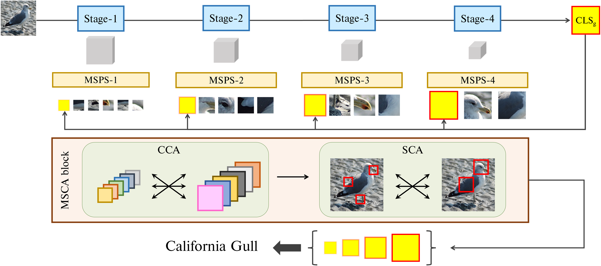

# M2Former for FGVR
This is a PyTorch implementation of the paper "***M2Former: Multi-Scale Patch Selection for Fine-Grained Visual Recognition***"<br>

[arXiv](https://arxiv.org/abs/2308.02161)

## Abstract
Recently, vision Transformers (ViTs) have been actively applied to fine-grained visual recognition (FGVR). ViT can effectively model the interdependencies between patch-divided object regions through an inherent self-attention mechanism. In addition, patch selection is used with ViT to remove redundant patch information and highlight the most discriminative object patches. However, existing ViT-based FGVR models are limited to single-scale processing, and their fixed receptive fields hinder representational richness and exacerbate vulnerability to scale variability. Therefore, we propose multi-scale patch selection (MSPS) to improve the multi-scale capabilities of existing ViT-based models. Specifically, MSPS selects salient patches of different scales at different stages of a multi-scale vision Transformer (MS-ViT). In addition, we introduce class token transfer (CTT) and multi-scale cross-attention (MSCA) to model cross-scale interactions between selected multi-scale patches and fully reflect them in model decisions. Compared to previous single-scale patch selection (SSPS), our proposed MSPS encourages richer object representations based on feature hierarchy and consistently improves performance from small-sized to large-sized objects. As a result, we propose M2Former, which outperforms CNN-/ViT-based models on several widely used FGVR benchmarks.

<p align="center">
    
</p>

## Dependencies
- cudatoolkit 11.0
- pytorch 1.7.1
- numpy 1.23.4
- pillow 9.2.0
- pandas 1.5.2
- einops 0.6.0
- matplotlib 3.7.0

## Data Preparation
In the paper, we use data from two publicly available datasets:

+ [CUB](http://www.vision.caltech.edu/datasets/)
+ [NABirds](https://dl.allaboutbirds.org/nabirds)

## Usage

Initial pre-trained weigths of MViTv2-B are available [here](https://github.com/facebookresearch/mvit).

An example command line for the training:
```bash
python train.py --data_root {PATH/TO/DATASET} --dataset {DATASET_NAME} --gpu_ids {GPU_IDs}
```

An example command line for the evaluation:
```bash
python eval.py --pretrained_model {PATH/TO/PRETRAINED_MODEL} --data_root {PATH/TO/DATASET} --dataset {DATASET_NAME} --gpu_ids {GPU_IDs}
```

## References
Parts of our codes based on:
* [TACJu/TransFG](https://github.com/TACJu/TransFG)
* [facebookresearch/mvit](https://github.com/facebookresearch/mvit)

## Citation
If you use this for research, please cite. Here is an example BibTeX entry:

```
@Article{app14198710,
AUTHOR = {Moon, Jiyong and Park, Seongsik},
TITLE = {M2Former: Multiscale Patch Selection for Fine-Grained Visual Recognition},
JOURNAL = {Applied Sciences},
VOLUME = {14},
YEAR = {2024},
NUMBER = {19},
ARTICLE-NUMBER = {8710},
ISSN = {2076-3417},
}
```

## Contact
If you have any questions about codes, please contact us by asdwldyd123@gmail.com.
